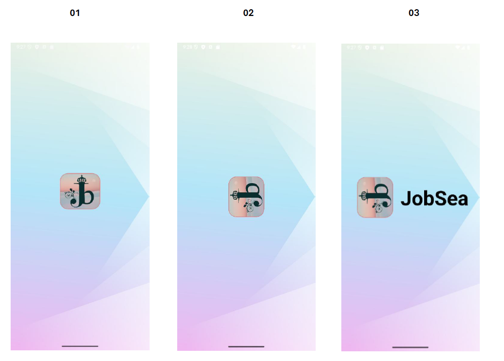
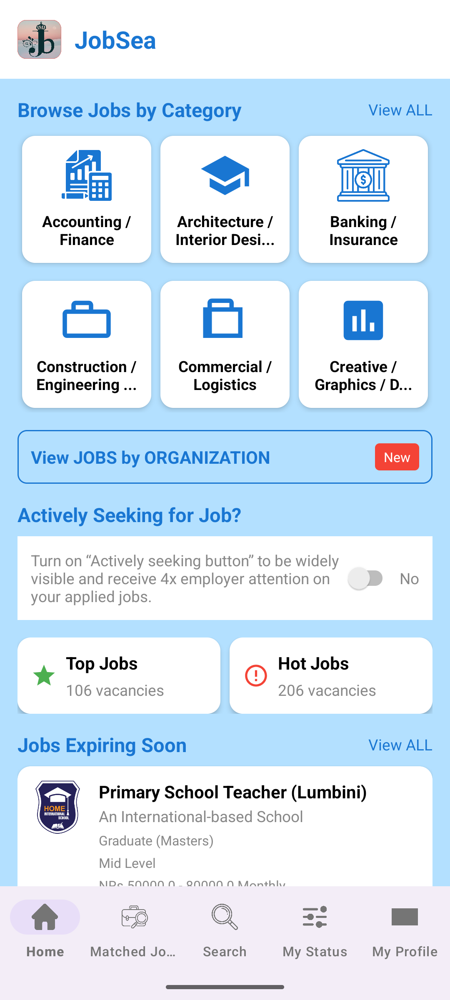
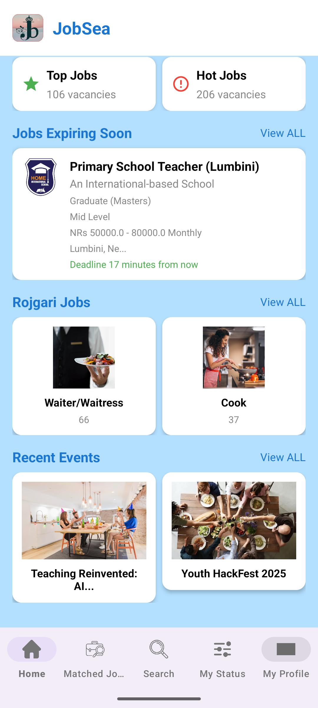
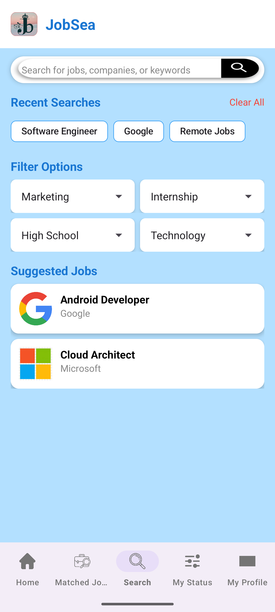
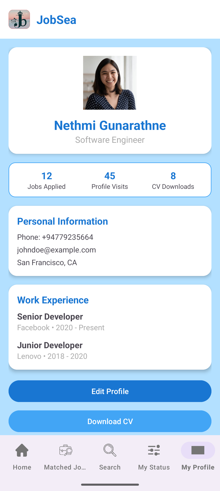

# 📱 JobSea – Job Search & Career Management App (UI Design)

> **JobSea** is a modern mobile app UI concept built in **Android Studio (Kotlin)** to help users browse and search for jobs with an intuitive and visually appealing interface.  
> This project focuses purely on **UI/UX design** — no backend integration.

## ✨ Features (UI Only)
- **Onboarding Screens** – Guided intro to the app’s features.  
- **Home Screen** – Browse jobs by category, featured jobs, and recommendations.  
- **Search & Filters** – Search bar, filter options, and recent searches (ChipView).  
- **Job Preview Pages** – Company logos, descriptions, and job details.  
- **Profile Section** – User profile layout with career preferences.  
- **Status Screen** – Track applications with an "Actively Seeking" toggle.  
- **Bottom Navigation** – Quick access to main sections.

## 🎨 UI/UX Design Highlights
- **60-30-10 Color Rule**:  
  - 60% White (Primary)  
  - 30% Light Blue (Secondary)  
  - 10% Dark Blue, Red, Green (Accent)
- **Layouts Used**:  
  - ConstraintLayout (Main screens)  
  - LinearLayout (Cards & stacked elements)  
  - NestedScrollView (Scrollable content)
- **Views & Components**:  
  - TextView, ImageView, Button, ImageButton  
  - Switch, Spinner, Chip, BottomNavigationView
- **Resource Management**: Centralized colors in `colors.xml` and strings in `strings.xml`.

## 🛠 Tech Stack
- **Language:** Kotlin  
- **IDE:** Android Studio  
- **Design Principles:** Material Design, 60-30-10 Color Rule  

## 🔗 Figma Design & PDF
- Figma (updated design): [View in Figma](https://www.figma.com/design/9aUBCO2ZSLV2UHZvpISDjq/Lab-exam-01?node-id=0-1&t=1K298T9Xrf3YOnLb-1)
- PDF Export: [Download JobSea-UI.pdf](JobSea-UI.pdf)
- prototype link - [figma](https://www.figma.com/proto/9aUBCO2ZSLV2UHZvpISDjq/Lab-exam-01?node-id=0-1&t=TZVlovyMJA1m8EBX-1)

Note: The Figma design has changed slightly from the Android Studio implementation.

<!-- Replace the placeholder link above and ensure design/JobSea-UI.pdf exists in your repo -->

## 📸 Screenshots

  
  
  

  
  
  
  

  
  

<!-- Put your actual images in a /screenshots folder and update filenames if needed -->

